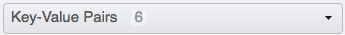
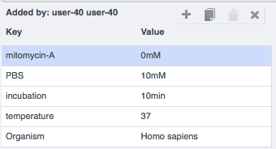

Annotate Data and Filter using Annotations
==========================================

In this section, we show various types of annotations supported in
OMERO and how to use them.

**Description**
---------------

We will show:

-  How to annotate Images, Datasets and Projects with

   -  Tags

   -  Key-Value Pairs

   -  File Attachments

   -  Ratings

-  How to filter thumbnails in the central pane of OMERO.web for

   -  Ratings

   -  Tags

**Setup**
---------

-  The data used are from the siRNAi-HeLa folder available at \ https://downloads.openmicroscopy.org/images/DV/siRNAi-HeLa/

-  The tags and ratings were added manually, then propagated for all users on the OMERO.server using the script \ https://github.com/ome/training-scripts/blob/master/maintenance/scripts/copy_tags_ratings.py

-  The Key-Value Pairs were added to the images in the siRNAi-HeLa Dataset for all users using the script \ https://github.com/ome/training-scripts/blob/master/maintenance/scripts/key_value_pairs.py

**Step-by-step**
----------------

#. Open a browser and enter the provided URL

#. Connect using the provided credentials

#. Let’s add annotations to Images. We will add Tags to indicate Metaphase stages of these cells.

   - Select one or more Images in the siRNAi-HeLa Dataset of cells which appear to be in metaphase.

   - Choose the Tag option in the right-hand General tab and click [ + ] to launch the Tag dialog.

   - Choose the existing Metaphase from the list of Tags (to filter, type above the list).

   - Click > to move it to the right column, then click OK.

#. Let’s now add Key-Value Pairs

   - Select an Image from the Dataset and in the right-hand General tab, click the harmonica Key-Value Pairs. 
   
      |image0|

      |image1|

   - The Key-Value Pairs allow you to add lab-book-like additional metadata for the Image. These Key-Value Pairs are also specifically searchable. [LINK to Search sister doc] 

#. It is also possible to add Comment, Attachment and Rating to selected Images.

#. Filter using annotations

   - Images can also be filtered by Name, Tag or Rating in the centre pane, using the Add filter chooser above the thumbnails.

   - For example, choose Tag and then select Metaphase from the list of Tags to show the images we tagged earlier.

   - Review the filtered Images, choose a favourite Image and under the Rating section in the right-hand pane, click on the 5th star to add a rating of 5
   
      |image2|

   - Now we can remove the filtering by Tag and instead filter by Rating of 5 to show only our favourite images.

.. |image2| image:: images/annotate3.png
   :width: 2.93977in
   :height: 0.91146in
