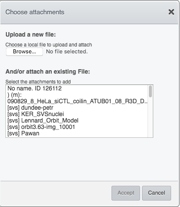
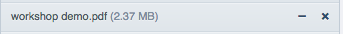
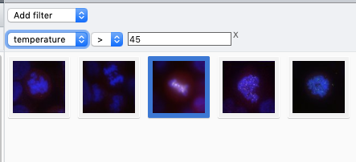

Annotate Data and Filter using Annotations
==========================================

There are several ways to add annotations to objects in OMERO. Here, addition and filtering of annotations using OMERO.web is described. You can add annotations using the OMERO.web interface to any object(s) that you can select in the left-hand-side tree or central pane, this means ``Project``, ``Dataset``, ``Image``, ``Screen``, ``Plate`` and ``Well``.

Description
-----------

We will show:

-  How to annotate Images, Datasets and Projects with:

   -  Tags

   -  Key-Value Pairs

   -  File Attachments

   -  Ratings

-  How to filter thumbnails in the central pane of OMERO.web for:

   -  Tags

   -  Key-Value Pairs

   -  Ratings

Setup
-----

-  The data used are from the `siRNAi-HeLa <https://downloads.openmicroscopy.org/images/DV/siRNAi-HeLa>`_ folder.

-  The tags and ratings were added manually, then propagated for all users on the OMERO.server using the script `copy_tags_ratings.py <https://github.com/ome/training-scripts/blob/master/maintenance/scripts/copy_tags_ratings.py>`_.

-  The Key-Value Pairs were added to the images in the siRNAi-HeLa Dataset for all users using the script `key_value_pairs.py <https://github.com/ome/training-scripts/blob/master/maintenance/scripts/key_value_pairs.py>`_.

Step-by-step
------------

#. Open a browser and enter the provided URL

#. Connect using the provided credentials

#. First, we will add Tags to indicate Metaphase stages of these cells.

   - Select one or more Images in the siRNAi-HeLa Dataset of cells which appear to be in metaphase.

   - Choose the Tag harmonica in the right-hand ``General`` tab and click ``[ + ]`` to launch the Tag dialog.

   - Choose the existing ``Metaphase`` tag from the list of Tags (to filter, type above the list).

   - Click ``>`` to move it to the right column, then click ``Save``.

#. Let us now add Key-Value Pairs

   - Select an Image from the Dataset and in the right-hand pane in ``General`` tab, click the harmonica Key-Value Pairs.
   
      |image0|

      |image1|

   - The Key-Value Pairs allow you to add lab-book-like additional metadata for the Image. These Key-Value Pairs are also specifically searchable. See :doc:`search-omero`.

#. For adding of File Attachments:

   - Select one or more objects in the left-hand side tree, such as ``Dataset`` or ``Image``.
   - Expand the ``Attachments`` harmonica in the right-hand pane. 
   - Click the plus button.

      |image1b|

   - You can attach any type of file using this function. If you select a file from your local filesystem using the ``Browse`` button, the feature will upload that file to the OMERO.server and save it there. The content of ``.pdf``, ``CSV`` and plain text files is also searchable in OMERO.

#. Remove a File Attachment.

   - Find the File Attachment you have just added.

   - Click on the ``minus`` sign to the right of it.

      |image1c|

   - The removal action just unlinks the File Attachment from the particual selected object(s). The File Attachment is not deleted from the server. If deletion is needed, click in the workflow above on the ``cross`` icon instead of the ``minus`` icon.

#. You can also add Comments and Rating to selected objects - follow analogous steps to the ones descirbed above for Tags, Key-Value pairs and File Attachments.

#. Filter using annotations

   - Images can also be filtered by Name, Tag, Key-Value pairs or Rating in the centre pane, using the ``Add filter`` chooser above the thumbnails.

   - For example, choose ``Tag`` and then select ``Metaphase`` from the list of Tags to show the images we tagged earlier.

   - Or choose to filter by Key-Values. You can then filter by a particular Key. If you select a Key where all the
     values are numbers, you can filter for those that are greater than, less than or equal to a threshold value.

      |image3|

   - Review the filtered Images, choose a favourite Image and under the ``Ratings`` section in the right-hand pane, click on the 5th star to add a rating of 5
   
      |image2|

   - Now we can remove the filtering by Tag and instead filter by Rating of 5 to show only our favourite images.

.. |image0| image:: images/annotate1.png
   :width: 3.59375in
   :height: 0.36458in
.. |image1| image:: images/annotate2.png
   :width: 3.54167in
   :height: 1.91667in

.. |image2| image:: images/annotate3.png
   :width: 2.93977in
   :height: 0.91146in

