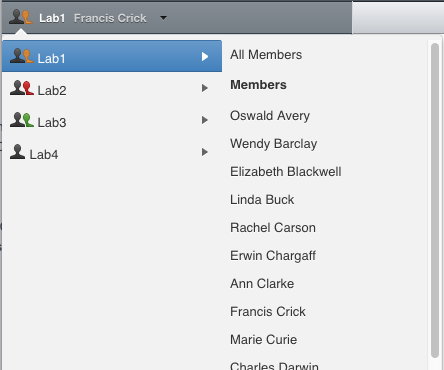
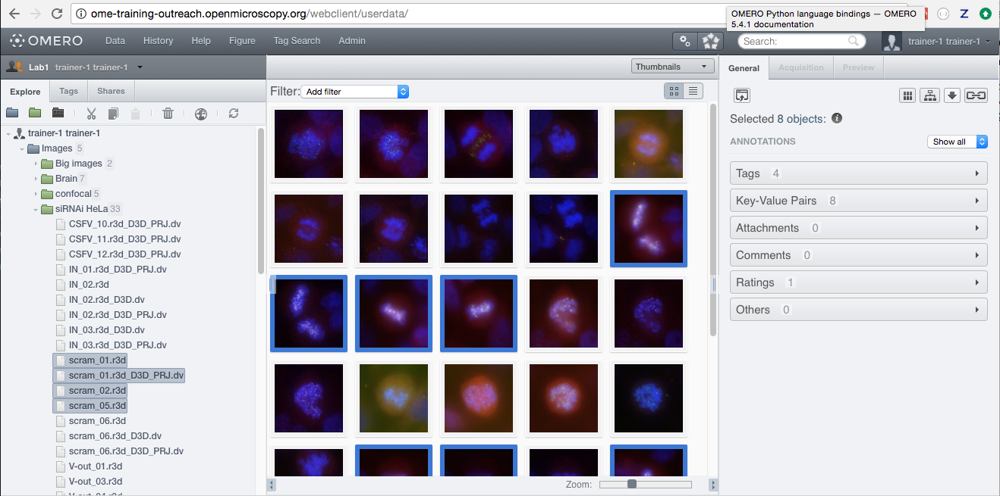
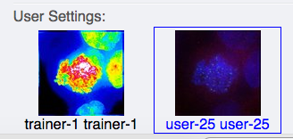
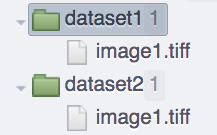
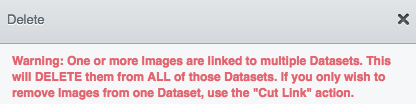
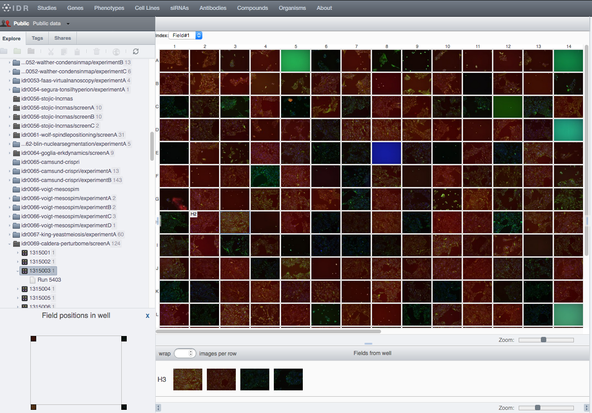
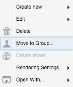
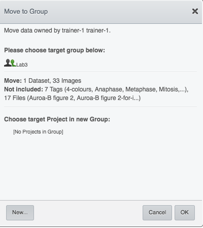

Data management and cooperation
===============================

In this document, we introduce the basic concepts of data management,
such as browsing, navigating to others’ data, and changing the display
of the images in OMERO. The example here uses OMERO.web, but majority of
the features described here are also present in OMERO.insight.

Further, we show how to use the Command Line Interface (CLI) for data management,
introducting mainly the features which are not present in the OMERO.web.

Description
-----------

We will show:

-  How to browse data in OMERO.web, navigating to yours and other users’ Images.

-  How to use the basic layout of OMERO.web for Images organized in Projects and Datasets.

-  How to use OMERO.web for viewing of High-Content Screening (HCS) data.

-  How to use the Preview panel.

-  How to adjust the rendering settings of your and other users’ images from the Preview panel.

-  How to organize Images in Projects and Datasets.

-  How to move the data between groups if you are data owner.

-  How to move the data between groups if you are an administrator working on behalf of others.

-  How to use Command Line for duplicating objects such as Images, Datasets or Projects.

-  How to use Command Line for changing the ownership of objects.

Setup
-----

OMERO.server has been installed and provisioned using an `Ansible playbook <https://github.com/ome/prod-playbooks/blob/master/omero/training-server/playbook.yml>`_.

Resources
---------

-  All data have been pre-imported. For more details, look at `data.md <https://github.com/ome/training-repos/blob/master/data.md>`_.

-  For the HCS data screenshot, the IDR data https://idr.openmicroscopy.org/webclient/?show=run-5403 were used.

-  To import Images and metadata, see the `maintenance scripts <https://github.com/ome/training-scripts/tree/master/maintenance>`_ for more details.

-  For import of Images, we use `in_place_import_as.sh <https://github.com/ome/training-scripts/blob/master/maintenance/scripts/in_place_import_as.sh>`_.

-  The cooperation in OMERO is described in `Groups and permissions system <https://docs.openmicroscopy.org/latest/omero/sysadmins/server-permissions.html>`_.

Step-by-Step
------------

Data layout and ownership, usernames (when running a workshop)
~~~~~~~~~~~~~~~~~~~~~~~~~~~~~~~~~~~~~~~~~~~~~~~~~~~~~~~~~~~~~~

All Images have been pre-imported into the
OMERO.server. For training purposes, we prepared 50 users on the
OMERO.server. Each of these 50 users has their own set of Images. These
sets consist of Images of the same name, size, shape, form and quality
for each user. Thus, the data of each user appears the same but, in
actual fact, are different and totally independent sets. Thus, small
discrepancies and differences between the users are completely possible.
Further, if one user deletes their own data in OMERO (please do not
delete anything on our server), this will not have any bearing on the
other 49 sets of Images belonging to the 49 other users.

The login names of the 50 users are “user-x” where x goes from 1 to 50.
We have given to each of the 50 users in OMERO a unique first name and
surname which we picked from a list of 50 famous scientists e.g. Ada
Lovelace or Francis Crick. This is the name (“your” name) which you will
see in the top-right corner of the OMERO webclient after you log in with your loginname.

In the OMERO webclient the default view shows only your own Images.

Browsing and rendering
~~~~~~~~~~~~~~~~~~~~~~

#. In your web browser, go to the server address provided.

#. Log in using the username and password provided.

#. OMERO offers various levels of permissions for groups and users. Depending on the permissions level of each group, a given user might be able to view, annotate or edit data belonging to other users. Permissions are managed by users with admin privileges. To highlight some of the collaborative aspects of OMERO, we will use a “Read-Annotate” group. This implies that users **can** view and annotate each other’s data but **cannot** delete other people’s data.

#. To see other people’s data, click on the (for example ``Lab1``) group name in the top-left corner of the webclient. Note that in case you are in a differently named group, the name in the top left corner will accordingly reflect this. Then use the menu to select the name of the group you wish to browse and then the user inside that group whose data you wish to see.

   \ |image0|

#.  You can browse ‘folders’ in the left-hand pane: Image folders are called Datasets and they are within Projects.

#.  When a Dataset is selected, Image thumbnails are shown in the centre panel.\ |image1|

#.  These represent imported Images. The original Images are stored on the server and the generated thumbnails allow us to browse them.

#.  `Bio-Formats <https://www.openmicroscopy.org/bio-formats/>`_ is used to read the pixel-data and metadata from over 150 different Image formats, including multi-z timelapse Images with many channels, they are referenced as 5D Images. Large pathology and medical Images are also supported.

#.  For HCS data, the layout of the OMERO.web is a bit different. The HCS data are usually organized in following manner:

    - ``Images`` are contained in ``Wells``

    - ``Wells`` are contained in ``Plates``

    - ``Plates`` are organized in ``Screens``.

    - A ``Plate`` may or may not contain several ``Runs``. 

    - The screenshot below shows the typical layout of a ``Plate`` in OMERO.web, where the ``Wells`` are organized in rows and columns. The ``Plate`` contains one ``Run``. One ``Well`` is selected in the central pane and it contains four ``Images`` whose thumbnails are displayed below the central pane. The bottom-left corner shows the positions of the Images (called ``Fields`` in this context) inside that ``Well``.

    |image3|

#.  Select an Image. In the right-hand pane, metadata read by Bio-Formats and stored in a relational database is displayed:

    - core metadata in the ``General`` tab

    - additional metadata in the ``Acquisition`` tab. 
    - All the metadata read by Bio-Formats can be downloaded at any time.

#. In the ``Preview`` tab in the right-hand panel, you can also view the Image.

#. For multi-plane Images, sliders allow you to move through Z or Time dimensions.

#. Viewing Images **does not** download the whole Image to the client. Only the viewed Image plane is rendered from the original Image file on the server and sent back to the OMERO.web client.

#. You can adjust the rendering settings for each channel e.g. turn on/off the channels, adjust color settings, look-up tables, etc..

#. The rendering settings can be saved to the server. This **never** changes the original Image data and can be reverted at any time.

#. The rendering settings can also be copied and pasted between Images. To modify the rendering settings in batch, click on the ``Save to All`` button to apply the same settings to, for example, all Images in a given Dataset.

#. You can use the settings which other users saved on your Images and apply them for your own Image. These settings are highlighted as thumbnails in the lower part of the Preview pane.
  
   \ |image2|

#. Your own settings are highlighted in blue.

#. You can revert to the original settings for an Image or Dataset. For example, using the context menu for a Dataset in the tree, select ``Rendering Settings > Set Imported and Save``.

#. Stay in ``General`` tab of the right-nand pane and adjust the channel names:

   - Select any image inside that Dataset and click on the pencil |image16| icon in the right-hand pane next to Channels.

   - Input “DAPI” instead of channel “457” and “GFP”, “Aurora-B” and “CY-6” for the other channels.

   - Click the ``Apply to All`` button |image17| and confirm by clicking ``Continue``. This will change the channel names of all the images in that Dataset.

Manage Images in Datasets/Projects
~~~~~~~~~~~~~~~~~~~~~~~~~~~~~~~~~~

You can organize the data in the left-hand side tree by creating new Projects and Datasets. You can link the Images to the new or existing Datasets and Datasets to new or existing Projects.
For HCS data, you can create new Screens and link Plates to these Screens.

#. Use the Project |image2b| and Dataset |image2c| icons above the left-hand side tree or the right-click contextual menu to create new Datasets or Projects.

#. Drag and drop Images between Datasets and Datasets between Projects. For HCS data, drag and drop Plates between Screens.

#. Copy Images using the right-click context menu: 
     - Select the Images to be copied, then right-click and click ``Edit > Copy Link``
     - Select the Dataset you want to copy the Images to, right-click and click on ``Edit > Paste Link``

       |image2d|

.. warning::
    **The ``Copy Link`` feature will not create a new independent copy of the Images.** The only way to create a fully independent copy in OMERO is to use the :ref:`Duplicate feature<Duplicatecli>`. The only thing that is copied during the actions above is the link between the Images and the Dataset. A single Image becomes linked to two Datasets.
    
    If you delete one of the Datasets, any Images within it that are linked to other Datasets will be retained. Nevertheless, if **you directly select and delete an Image that has been copied from another Dataset it will be deleted and lost from both Datasets.** There is a clear warning in the OMERO.web when you try to delete such doubly-linked Image, see screenshot below.

|image2e|

.. note::
    Organizing data of other users as an administrator, restricted administrator or group owner is made easier in OMERO.web in the following manner.

    If you are an administrator or administrator with restricted privileges working in a group you are not a member of, except for private groups where this workflow is not possible, all containers (Projects, Datasets, Screens) created in OMERO.web in such a group will belong to the user whose portfolio you are working with.

    .. versionchanged:: 5.8.0 Also the links between the containers and their content will belong to that user. In case there are different owners of the container and of the linked content, then the created link will belong to the owner of the linked content.

    This helps to retain the possibility for this user to manipulate their containers even though you created them.

    Nevertheless if the workflow is executed by a group owner (i.e. not an administrator), the new links will belong to the group owner and the user will not be able to unlink the objects later. This is a current limitation.

Move data between groups
~~~~~~~~~~~~~~~~~~~~~~~~

In OMERO, ``Users`` are organized in ``Groups``. The ``Groups`` allow a level of viewing and cooperation between the members of the group which can be adjusted by changing the permissions level on that group. A ``User`` can be a member and have their data in one or more ``Groups``. Thus it is sometimes necessary to move the data between groups. This action can be done by the owners of the data themselves or by an administrator or an administrator with restricted privileges.

Note that caution has to be taken in case the data are linked to other users' containers (``Datasets``, ``Projects``). If you move only the contents of those containers (``Datasets`` or ``Images``) and not the containers themselves (``Projects`` or ``Datasets``), the links between such containers and the ``Images`` or ``Datasets`` which are moved will be deleted.

Further, if any objects are moved, the links to any annotations (such as ``Tags`` or attached ``File annotations``) linked to these objects will be severed in case these annotations belong to others or in case these annotations belong to you but are also linked to some other objects in the original group which are not being moved.

Note that except for using OMERO.web described below, it might be worth in some situations to consider moving data between groups using the Command Line Interface see `CLI Moving Objects between Groups <https://docs.openmicroscopy.org/omero/latest/users/cli/chgrp.html>`_.

Move data between groups: owners of data
~~~~~~~~~~~~~~~~~~~~~~~~~~~~~~~~~~~~~~~~

If you are an owner of the data, you can move the data between the groups you are a member of.

#. In OMERO.web, select the data to be moved in the left-hand side tree.

#. Right-click and select ``Move to Group...``.

   |image4|

#. Select the group you want to move the data to.

#. A message ``Checking which linked objects will be moved`` will appear and a spinner to the left of it. Wait until the spinner vanishes and a list of objects to be moved and a list of objects which are not included in the move appears.

   |image5|

#. Check both lists. Please read the note above about which objects are typically not included and reconsider the ``Move`` action again. The ``not included`` objects will not be linked to the ``Moved`` objects anymore if you go ahead with the move, the linkage will be lost.

#. In case you are happy with the ``Move`` action to go ahead, select a target Dataset or Project or create a new one and click ``OK``.

Move data between groups: administrators
~~~~~~~~~~~~~~~~~~~~~~~~~~~~~~~~~~~~~~~~

The administrators can move the data to any group, not only to the group where the owner of the data is a member. Note though that it is not desirable to create a situation where the data belong to someone who is not a member of the group where the data reside.

Typically an administrator works on behalf of other users in a group where the administrator is not a member. For these cases, some features of OMERO.web help to facilitate the moving of data for others (note that these features are not yet available in the Command Line Interface).

#. Navigate to the data of a user in a group that you are not a member of.

#. Select the data in the left-hand tree.

#. Right-click and select ``Move to Group...``.

#. Follow further the steps described in the section ``Move data between groups: owners of data`` above, taking note of the ``Not included`` objects.

#. When creating new Datasets or Projects during the move, note that these containers will belong to the owner of the data, not yourself. Also the links between the new containers and the moved data will belong to the owner of the data. This should help to facilitate a smooth workflow, retaining the data handling possibilities such as reorganizing the data, renaming the containers you created for them etc. for the owner of the data. 

.. _Duplicatecli:

*Command Line: Duplicating objects*
~~~~~~~~~~~~~~~~~~~~~~~~~~~~~~~~~~~

You can duplicate objects in OMERO. The functionality is available only on the CLI for now. The duplication creates a fully independent duplicate of the duplicated object and, when desired, the objects linked to the duplicated object as well. When the duplicate is later deleted, it will not have an influence on the original, which stays preserved. Similarly, when the original is later deleted, the duplicate stays preserved as well.

In case of Image objects, which have image files linked, the duplication creates a new image file which is linked to the original image file by a hard link. This means every duplication of an Image increases the number of hard links on the image file in Managed Repository of OMERO, but does not duplicate the image file itself, and thus does not increase the storage demands too much. 

In case of File Attachment objects though, which also have files to them, each duplication will duplicate the linked file, thus doubling the storage space necessary for these File Attachment files.

Resources
---------

-  Necessary software versions:

   - **OMERO.server 5.6.3 or later**
   - **omero-cli-duplicate plugin 0.4.0 or later**

-  Documentation:

   - `README of the omero-cli-duplicate repository <https://github.com/ome/omero-cli-duplicate/blob/master/README.rst>`_

   - `Application Programming Interface documentation <https://docs.openmicroscopy.org/omero-blitz/5.5.7/slice2html/omero/cmd/Duplicate.html>`_

-  Plugin for duplication on Command Line:

   - `omero-cli-duplicate on PyPI <https://pypi.org/project/omero-cli-duplicate/#description>`_

Setup
-----

**Duplicate plugin installation**

- Go to the environment where you installed your OMERO.cli as specified under -  https://docs.openmicroscopy.org/latest/omero/users/cli/installation.html.

- Activate the virtual environment.

- Run::
    
   $ pip install omero-cli-duplicate

Step-by-Step
------------

#. On your local machine, open a terminal

#. Activate the virtual environment where ``omero-py`` is installed or add it to ``PATH`` e.g.::
    
   $ export PATH=/opt/omero/server/venv3/bin:$PATH

#. The variables ``$ID​1`` and ``$ID2`` below are the IDs of the ​selected Datasets. To duplicate two Datasets with their Images and annotations on both the Images and the Datasets, run::
    
   $ ​omero duplicate Dataset:$ID1,$ID2 --report

#. The duplicated Datasets will not be linked to any Project, even if the originals were linked to some Project. 

#. Duplicate two Images with many ROIs on them. The ROIs duplication might take a long time. To exclude the duplication of the ROIs, run::

   $ omero duplicate Image:$ID1,$ID2 --ignore-classes=Roi --report 

#. Find the duplicated Images in the Orphaned Images and Drag and Drop them into a Dataset or create a new Dataset for them.

#. Duplicate two Projects of another user in read-annotate group type. The group name in our example below is `read-annotate-group`. Log in as `user-1` and duplicate Projects belonging to `user-2` in that group. Further, instead of duplicating all the annotations of `user-2`, link all the original annotations such as Tags, Key-Value pairs and FileAnnotations of `user-2` to the corresponding objects in the duplicate, and duplicate only Comments and Ratings. The duplicate and Comments and Ratings on it will belong to `user-1`, but the other annotations will still belong to `user-2`. Run::

   $ omero logout
   $ omero login -u user-1 -g read-annotate-group
   $ omero duplicate Project:$ID1,$ID2 --reference-classes=Annotation --duplicate-classes=CommentAnnotation,LongAnnotation --report

#. Duplicate two Projects of another user in read-only group type. The group name in our example below is `read-only-group`. If the duplicator is not an administrator, administrator with restricted privileges or group owner, they cannot link the annotations of another user to their duplicate in a read-only group. They might duplicate all the annotations or exclude the duplication of all the annotations by excluding the Link duplication to the relevant objects as shown below. Run::

   $ omero logout
   $ omero login -u user-1 -g read-only-group
   $ omero duplicate Dataset:$ID1,$ID2 --ignore-classes=IAnnotationLink,Roi --report

.. note::
    You must log in to the group where the data are, either by virtue of this group being your default group or by using the `-g` flag as shown in the examples above, otherwise the `omero-cli-duplicate` plugin will not find the data. This is a current limitation.

    If you intend to move the duplicate into a different group, it is recommended that you duplicate the annotations as well. If you link the annotations from other objects to your duplicates, the link might be cut during the subsequent move of that duplicate to another group.

.. |image16| image:: images/management16.png
   :width: 0.22917in
   :height: 0.1875in
.. |image17| image:: images/management17.png
   :width: 0.78125in
   :height: 0.23958in
