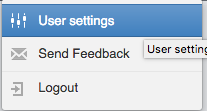
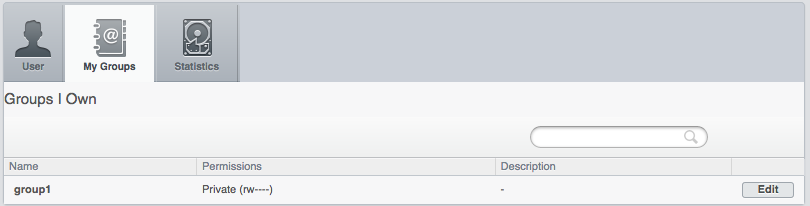

Administrate Groups and Users
=============================

Description
-----------

This chapter will show how to manage groups and users using the graphical interface in OMERO.web and the command-line interface. Most of following tasks below can only be done by users with some
administrator privileges. We will show:

- How to manage groups, creating and editing a new/existing group
- How to manage users, creating and editing a new/existing user

Resources
---------

-  Documentation:

   -  https://docs.openmicroscopy.org/latest/omero/sysadmins/server-permissions.html

   -  https://docs.openmicroscopy.org/latest/omero/sysadmins/restricted-admins.html

   -  https://docs.openmicroscopy.org/omero/latest/sysadmins/cli/usergroup.html

-  Script for Command Line User/Group management

   - `create_groups_users.sh <https://github.com/ome/training-scripts/blob/master/maintenance/scripts/create_groups_users.sh>`_

-  File defining the User/Group setup used by the script

   - `create_groups_users_setup <https://github.com/ome/training-scripts/blob/master/maintenance/scripts/create_groups_users_setup>`_

Setup
-----

No setup needed for OMERO.web administration panel (see Web Interface chapter below) except working OMERO.web.

**Command Line interface installation**

The installation instructions can be
found at `CLI installation <https://docs.openmicroscopy.org/latest/omero/users/cli/installation.html>`_.

Step-by-step
------------

Administrate using the Web Interface
------------------------------------

#. In your web browser, go to the server address provided.

#. Log in using the username and password provided.

#. In the top toolbar, click the ``Admin`` button |image0|\ . Note that the ``Admin`` button is only available for users with certain privileges (administrators and administrators with restricted privileges). If you are a user or a group owner, navigate to the section ``Web Interface: Users change their own settings`` below.

*Web Interface: Managing Groups*
~~~~~~~~~~~~~~~~~~~~~~~~~~~~~~~~

#. Click on the ``Groups`` tab. You can search for groups if desired

#. To create a new Group, click on the ``Add new Group`` button. Note that the ``Name`` and ``Permissions`` fields are mandatory.

#. Click ``Save``.

#. The new group will be shown in the list of Groups.

#. To edit a Group, click on the ``Pencil`` button |image1|.

#. You can add or remove members or group’s owners or change group permissions.

#. Before removing a user from a group, it is preferable to move their data to another group or transfer ownership of their data to another user. Having a data owned by someone who is not a member of the group is not desirable.

#. Click ``Save``.

*Web Interface: Managing Users*
~~~~~~~~~~~~~~~~~~~~~~~~~~~~~~~

#. Click on the ``Users`` tab

#. You can search for users if you wish.

#. OMERO.web denotes the user categories using small helpful icons.

   - Users with administrator privileges have a ``tools`` icon \ |image2|.

   - Active users have an icon with ``blue circle`` \ |image3|.
   
   - Inactive users have a ``lock`` icon |image4|.

   - LDAP users have a ``red hexagon`` |image5|.

#. To create a new user, click on the ``Add new User button``.

#. Mandatory fields are highlighted in red.

#. You can select the role of the user to be:
     - ``User`` (no special privileges)
     - ``Administrator`` (this means full administrator)
     - ``Administrator with restricted privileges``

#. If you choose the role to be ``Administrator with restricted privileges``,
   you must also select the privileges in a subsequent menu. 
   Creating an administrator with restricted privileges allows to give some limited rights to some trusted users
   e.g. to allow a facility manager to import data for other users. It is currently preferable to create users with such roles via the OMERO.web Interface.
   More about
   ``Administrator with restricted privileges`` can be found in `this OMERO documentation section <https://docs.openmicroscopy.org/omero/latest/sysadmins/restricted-admins.html>`_.

#. Click ``Save``.

#. To edit a User, click on the ``Pencil`` button |image6| to the right of the line with the name of the user. You can add or remove the user to/from a group or modify the roles.

#. Click ``Save``.

*Web Interface: Users change their own settings*
~~~~~~~~~~~~~~~~~~~~~~~~~~~~~~~~~~~~~~~~~~~~~~~~

#. Note that these features are not limited to administrators, any user can change their settings in the manner described here. Furthermore, this is the preferred way for Group Owners to manage their groups.

#. In OMERO.web, click in the top-right corner of the webclient, click on your name, then, in the dropdown menu, click on ``User settings``.

   |image7|

#. In the interface that appears, you can change your password and default group. Default group is the group you log in to by default when logging to OMERO. Your data in your default group is what you typically see immediately after loggging in for example to OMERO.web, whereas your data in your other (non-default) groups have to be explicitly navigated to.

#. **For group owners only**: You can now navigate to the group(s) you own by clicking onto ``My Groups`` tab.

   |image8|

#. Identify the group you want to edit in your group list and click on ``Edit`` button. 

#. You can now add or remove group members, add members as group owners (a group can have many owners, besides youself). When removing users from the group, make sure that the data owned by a user is moved or transferred to another user before removing the user from the group.

#. You can also change the permissions level of your group. Note though that this is an action which needs careful thinking, especially if you are going from more permissive group types towards less permissive ones.

Administrate using the Command Line Interface (CLI)
---------------------------------------------------

Typically, the administration of Groups and Users in OMERO is done in OMERO.web (see section above), as it is more user friendly. The Command Line Interface (CLI) cannot offer the easy quick overview, filtering and searching and intuitively named buttons and tabs. For creation of administrators with restricted privileges, there are several key features missing from the CLI which are present in OMERO.web. 
Nevertheless, some features for handling LDAP users are implemented only in the CLI. 
Further, the CLI offers an environment in which custom bash scripts for user/group creation and maintenance can be executed. One example of such script can be taken from `create_groups_users.sh <https://github.com/ome/training-scripts/blob/master/maintenance/scripts/create_groups_users.sh>`_. The script consumes a file `create_groups_users_setup <https://github.com/ome/training-scripts/blob/master/maintenance/scripts/create_groups_users_setup>`_ in which a certain user-group setup is defined.

*Command Line: Managing Groups*
~~~~~~~~~~~~~~~~~~~~~~~~~~~~~~~

#. By default when creating a group, its permissions level is set to ``private``. To create a new read-annotate group ``Lab1``, run::

     $ omero group add Lab1 --type=read-annotate

#. Or, you can define the permissions of the new group in a different way::
     
     $ omero group add Lab1 --perms='rwra--'

#. To list all the groups and save the output for example in a CSV file::

     $ omero group list --style csv > groups.csv

#. To add an existing user ``user-1`` to the ``Lab1`` group and make him/her a group owner (the option ``--as-owner`` is not needed when adding a member), run::

     $ omero group adduser user-1 --name=Lab1 --as-owner

#. Let us add ``trainer-1`` as an owner of the group too::

     $ omero group adduser trainer-1 --name=Lab1 --as-owner

#. To remove ``user-1`` from the list of owners (``user-1`` will still be a member of the ``Lab1`` group)::

     $ omero user leavegroup Lab1 --name=user-1 --as-owner

#. Note that the previous command when run without the ``--as-owner`` flag would remove the ``user-1`` from the group completely. Thus, it is an alternative to the following command.

#. To remove ``user-1`` from the ``Lab1`` group, you can also run::

     $ omero group removeuser user-1 --name=Lab1

#. To edit the ``Lab1`` group, first determine its ID::

     $ omero group info --group-name Lab1

     id \| name \| perms \| ldap \| # of owners \| # of members

     -----+-------+--------+-------+-------------+--------------

     653 \| Lab1 \| rwra-- \| False \| 0 \| 0

#. Change the group name to ``LabN``::

     $ omero obj update ExperimenterGroup:653 name='LabN'

#. Let us reset the name back to ``Lab1`` to simplify the rest of the workflow.

#. Change the group's permissions to read-write::

     $ omero group perms --perms='rwrw--' --name='Lab1'

*Command Line: Managing Users*
~~~~~~~~~~~~~~~~~~~~~~~~~~~~~~

#. Create a new user with login name ``lpasteur`` and at the same time add this user (with first and last name ``Louis Pasteur``) to the ``Lab1`` group::

     $ omero user add lpasteur Louis Pasteur --group-name Lab1

#. Let us now add the user to another group::

     $ omero user joingroup Lab2 --name=lpasteur

#. To edit the user and for example add an email address, first determine the user’s ID::

     $ omero user info --user-name lpasteur

#. Add an email address (supposing the ID of the user is ``123``)::

     $ omero obj update Experimenter:123 email='lpasteur@demo.co.uk'

#. Make a user inactive. User cannot be deleted but it is possible to prevent a user from logging in. For that, we need to remove the user from the ``user`` group (an internal OMERO group)::

     $ omero user leavegroup user --name=lpasteur

#. To reactivate the user::

     $ omero user joingroup user --name=lpasteur

*Command Line: Managing LDAP Users*
~~~~~~~~~~~~~~~~~~~~~~~~~~~~~~~~~~~

If LDAP authentication is configured on your OMERO.server, the OMERO.server synchronizes the user list with an LDAP server, thus enabling an easy user creation and maintenance. It is possible to convert non-LDAP OMERO users to LDAP authentication using the command ``omero ldap setdn``. See further information in the links under the Resources section of this guide. See `LDAP authentication
<https://docs.openmicroscopy.org/omero/latest/sysadmins/server-ldap.html>`_ and `LDAP plugin design <https://docs.openmicroscopy.org/omero/5.6.1/developers/Server/Ldap.html>`_.

Typically, it is impractical to synchronize the OMERO groups with LDAP groups. In such case, the OMERO.server can be configured in such a way that LDAP users when they first log in to OMERO will be added to a specific private OMERO group (let us call this group ``My Data``). This situation is further explored in the example below.

The administrator or administrator with restricted privileges can add an LDAP user to OMERO even before the user have ever logged in to OMERO:

#. First create the existing LDAP user as OMERO user (example user name is ``enoether``)::

      $ omero ldap create enoether

#. The user is now a member of the ``My Data`` group in OMERO. Then (if needed) add the user to the ``Lab1`` group::

      $ omero group adduser enoether --name=Lab1

#. Note that it is advisable to clarify the OMERO group membership situation of the LDAP users soon after their joined OMERO. This can be done for example by adding the new user to their lab group (e.g. ``Lab1``) in OMERO as well and changing the default group of such user in OMERO to be their lab group. See above for how to change the default group of a user. Otherwise, the new LDAP&OMERO users might be importing their data into the ``My Data`` group for some period of time, without realizing the data are not accessible (because ``My Data`` is a private group) to their colleagues in the lab group for cooperative purposes.

